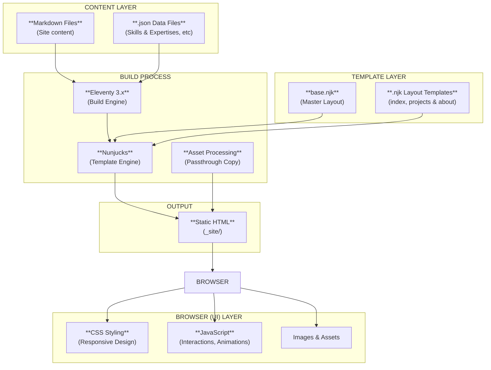

# Roxo Eleventy - Personal Portfolio

Roxo is a modern digital agency theme built with **Eleventy** and **Nunjucks** templating. Perfect for creative agencies, freelancers, graphic designers, photographers, and any professionals showcasing digital services. It features a responsive portfolio, blog, team profiles, skills assessment with animated meters, testimonials, and contact capabilities.

Checkout the live demo [here](https://roxo-eleventy.staticmania.com/)

## Overview

This is a personal portfolio website built with Eleventy 3.0.0 featuring:
- **Dynamic Content Management** - .json-based data files for all content
- **Responsive Design** - Bootstrap 4 grid system
- **Interactive Skill Meters** - SVG animations triggered on viewport visibility
- **References** - .md-based project showcase
- **Dark / Light UI theme** - Theme toggle with persistence support
- **Performance Optimized** - Static site generation with fast load times
- **Accessibility** - Semantic HTML and ARIA labels (WIP)

## Project Structure Diagram

## Technology Stack

| Technology | Version | Purpose |
|-----------|---------|---------|
| Eleventy (11ty) | 3.0.0 | Static site generator |
| Nunjucks | 3.2.4 | Template engine |
| Bootstrap | 4.1.1 | CSS framework & grid |
| jQuery | 3.3.1 | DOM manipulation |
| PhotoSwipe | 5.4.4 | Lightbox gallery |
| Font Awesome | 4.7.0 | Icon library |
| Slick | 1.8.0 | Carousel / Slider |
| GSAP / TweenMax | 1.19.0 | Animation library |
| Sharp | 0.33.5 | Image processing |
